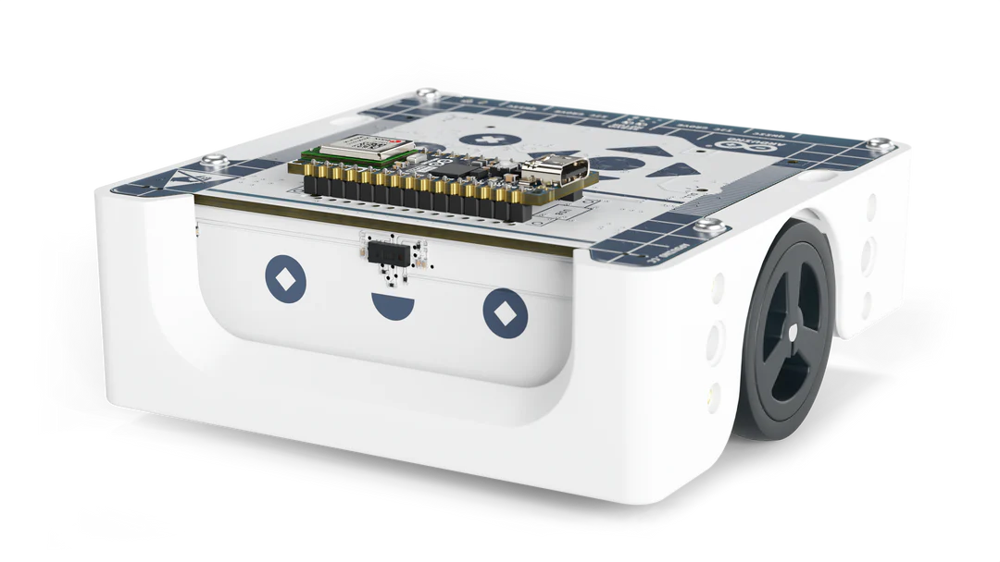

# `ucpack`

<div align="right" style="display: block; float: right; margin-left: 20px;">
    
</div>

Rust implementation of the ucpack serialization format used in the Arduino Alvik using [serde](https://docs.rs/serde).

This crate does not implement the body protocol itself, but rather the binary serialization format it uses
to encode its messages.

### The crate

This crate exposes a struct called `UcPack` which you can initialize to start encoding and decoding [serde](https://docs.rs/serde)
compatible data types and structures.

> [!WARNING]
> Not every type is compatible with ucpack. Namely any integer above 16 bits, lists and maps.

You can also `const` initialize `UcPack` and use it `const`-ly from anywhere if carrying state
isn't an option:
```rust
const packer: UcPack = UcPack::new(b'A', b'#');

fn main() {
    packer.serialize_slice(...); // ecc..
}
```

### The protocol
_NOTE: Table gently borrowed from ucpack's c++ repo_

A packet is managed as:

| index_byte           | message length | message                     | stop_byte            | crc8   |
|:--------------------:|:--------------:|:---------------------------:|:--------------------:|:------:|
| 1 byte (_default A_) | 1 byte         | N bytes from message length | 1 byte (_default #_) | 1 byte |

This crate, opposed to the c++ and micropython respectives, is agnostic
across the `message` content (referred to by the name `payload` in this crate).
